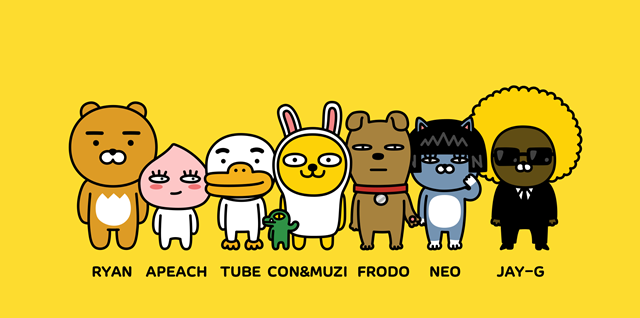

# zeze.github.io

zeze's Personal Website.

## TODO

### Make Directories & Files

- [x] `index.html`
- [x] `css/style.css`
- [x] `images/`


###제목 
```html
<h1>heading 1</h1>
<h2>heading 2</h2>
<h3>heading 3</h3>
<h4>heading 4</h4>
<h5>heading 5</h5>
<h6>heading 6</h6>

# Markdown H1
## Markdown H2
### Markdown H3
#### Markdown H4
##### Markdown H5
###### Markdown H6


###목록
<!-- 비순차 -->
<ul>
	<li>item 1</li>
	<li>item 2</li>
	<li>item 3</li>
</ul>

<!-- 순차 -->
<ol>
	<li>item 1</li>
	<li>item 2</li>
	<li>item 3</li>
</ol>


###비순차 목록
- item 1
- item 2
- item 3

###순차 목록
1. item 1
2. item 2
3. item 3


###이미지


<!-- -->





###하이퍼링크

<a href="http://iropke.com/">이롭게 에이전시</a>

- [이롭게 광고, 반응형 웹(Responsive Web Design) 편](http://iropke.com/blog/archives/4436)


###인용 구문

인용절은 보통 들여쓰기를 통해 사용자에게 일반 문장과 구분해준다.<br>
HTML 언어에서는 `<blockquote>`요소를 사용하여 인용절을 구조화한다.

> "Design is All. All is Design."<br>
> "Learn By Doing"<br>
> "그것이 최선입니까? 확실해요?"


###표 

Job Type | Role
---|---
Planner | Plan
Designer | Design
Developer | Develop
